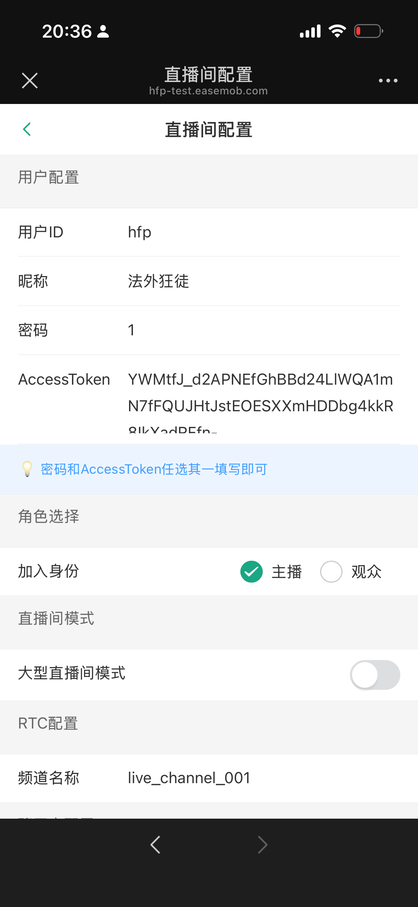
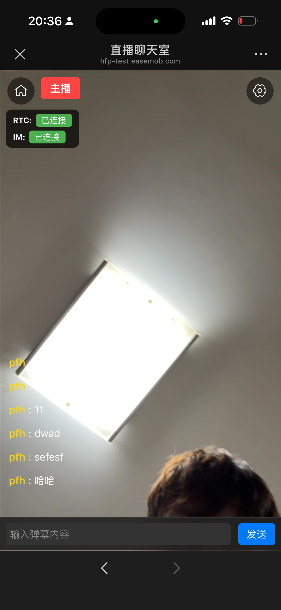
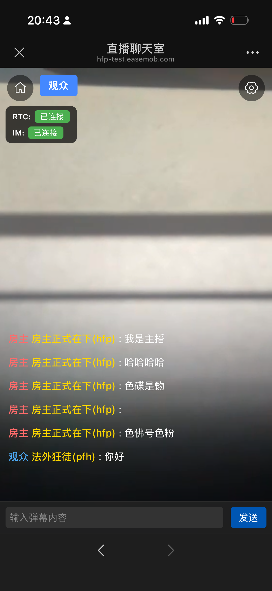

# 声网 RTC 直播能力集成文档

本文档详细介绍如何在 Vue 3 项目中集成声网（Agora）RTC SDK 实现直播能力，包括音视频推拉流、角色管理、Token 鉴权等核心功能。

## 目录

- [架构概述](#架构概述)
- [技术栈](#技术栈)
- [H5 真机效果预览](#h5-真机效果预览)
  - [直播间配置页面](#直播间配置页面)
  - [主播端界面](#主播端界面)
  - [观众端界面](#观众端界面)
- [核心模块说明](#核心模块说明)
  - [1. LiveRTC 封装类](#1-livertc-封装类)
  - [2. LiveRTC Vue 组件](#2-livertc-vue-组件)
  - [3. 直播间主页面](#3-直播间主页面)
  - [4. 环信 IM 集成](#4-环信-im-集成)
- [直播流程详解](#直播流程详解)
- [角色与权限](#角色与权限)
- [API 参考](#api-参考)
- [配置说明](#配置说明)
- [常见问题](#常见问题)

---

## 架构概述

```
┌─────────────────────────────────────────────────────────────┐
│                     直播间页面 (emLiveChatroom)               │
│  ┌───────────────────────────────────────────────────────┐  │
│  │              LiveContainer 容器组件                    │  │
│  │  ┌───────────────────────────────────────────────┐   │  │
│  │  │  RTC层 (LiveRTC) - 视频流底层                  │   │  │
│  │  │  ┌─────────────────────────────────────────┐  │   │  │
│  │  │  │  主播: 本地视频大画面 + 观众小窗         │  │   │  │
│  │  │  │  观众: 远程主播视频大画面               │  │   │  │
│  │  │  └─────────────────────────────────────────┘  │   │  │
│  │  └───────────────────────────────────────────────┘   │  │
│  │  ┌───────────────────────────────────────────────┐   │  │
│  │  │  弹幕层 (DanmakuList) - 中层                  │   │  │
│  │  │  - 互动消息滚动显示                            │   │  │
│  │  └───────────────────────────────────────────────┘   │  │
│  │  ┌───────────────────────────────────────────────┐   │  │
│  │  │  控制层 - 顶层                                 │   │  │
│  │  │  - 顶部: 角色标识、设置按钮                    │   │  │
│  │  │  - 底部: 消息输入框、发送按钮                  │   │  │
│  │  └───────────────────────────────────────────────┘   │  │
│  └───────────────────────────────────────────────────────┘  │
└─────────────────────────────────────────────────────────────┘
```

---

## 技术栈

| 技术 | 版本 | 说明 |
|------|------|------|
| Vue | 3.x | 前端框架 |
| TypeScript | 4.x+ | 类型支持 |
| Agora RTC SDK | ^4.24.2 | 声网音视频 SDK |
| Easemob WebSDK | - | 环信即时通讯 SDK |
| Vite | - | 构建工具 |

---

## 核心模块说明

### 1. LiveRTC 封装类

**文件路径**: `src/easeim/live-rtc.ts`

`LiveRTC` 类是对声网 RTC SDK 的封装，提供直播所需的核心音视频功能。

#### 核心功能

```typescript
export class LiveRTC {
  // RTC 客户端实例
  public client: IAgoraRTCClient | null = null;
  
  // 频道与认证信息
  public channelName: string | null = null;
  public agoraAppId: string | null = null;
  public agoraUid: number | null = null;
  public agoraToken: string | null = null;
  
  // 本地音视频轨道
  public localAudioTrack: IMicrophoneAudioTrack | null = null;
  public localVideoTrack: ICameraVideoTrack | null = null;
  
  // 当前角色: 'host' | 'audience'
  public currentRole: ClientRole = 'audience';
}
```

#### 初始化 RTC 客户端

```typescript
public async initRTC(role: ClientRole): Promise<void> {
  this.currentRole = role;
  
  // 创建直播模式客户端 (live mode + H264 编码)
  this.client = AgoraRTC.createClient({ 
    mode: 'live', 
    codec: 'h264' 
  });
  
  // 设置角色
  await this.client.setClientRole(role);
  
  // 主播角色需要创建本地音视频轨道
  if (role === 'host') {
    await this.createLocalTracks();
  }
}
```

**关键参数说明**:
- `mode: 'live'` - 直播模式，支持主播和观众角色
- `codec: 'h264'` - 视频编码格式，兼容性较好
- `setClientRole()` - 动态切换角色（主播/观众）

#### 创建本地音视频轨道（主播）

```typescript
public async createLocalTracks(): Promise<void> {
  // 创建麦克风音频轨道
  this.localAudioTrack = await AgoraRTC.createMicrophoneAudioTrack();
  
  // 创建摄像头视频轨道，设置编码配置为 480p
  this.localVideoTrack = await AgoraRTC.createCameraVideoTrack({
    encoderConfig: '480p_1',
  });
}
```

**编码配置选项**:
- `480p_1` - 640×480 @ 15fps
- `720p_1` - 1280×720 @ 15fps
- `1080p_1` - 1920×1080 @ 15fps

#### 获取 RTC Token

通过环信 IM SDK 获取声网 RTC Token:

```typescript
public async getAccessToken(chatClient: EasemobChat.Connection): Promise<string | null> {
  // 调用环信 SDK 的 getRTCToken 方法
  const res = await chatClient.getRTCToken('*');
  
  this.agoraAppId = res.data.appId;
  this.agoraUid = res.data.RTCUId;
  this.agoraToken = res.data.RTCToken;
  
  return this.agoraToken;
}
```

**Token 获取流程**:
1. 先登录环信 IM
2. 调用 `chatClient.getRTCToken('*')` 获取通用 RTC Token
3. 返回的 Token 包含 `appId`、`RTCUId`、`RTCToken`

#### 加入频道

```typescript
public async joinRTC(onJoined?: () => void): Promise<void> {
  // 加入 RTC 频道
  await this.client.join(
    this.agoraToken,    // Token
    this.channelName,   // 频道名
    null,               // 可选信息
    this.agoraUid       // 用户 UID
  );
  
  // 执行回调（用于发布流等后续操作）
  if (onJoined) {
    await onJoined();
  }
}
```

#### 发布本地流（主播）

```typescript
public async publishLocalTracks(): Promise<void> {
  if (this.localAudioTrack && this.localVideoTrack) {
    await this.client.publish([
      this.localAudioTrack, 
      this.localVideoTrack
    ]);
  }
}
```

#### 离开频道

```typescript
public async leaveRTC(): Promise<void> {
  // 停止并关闭本地轨道
  if (this.localAudioTrack) {
    this.localAudioTrack.stop();
    this.localAudioTrack.close();
    this.localAudioTrack = null;
  }
  if (this.localVideoTrack) {
    this.localVideoTrack.stop();
    this.localVideoTrack.close();
    this.localVideoTrack = null;
  }
  
  // 离开频道
  await this.client.leave();
}
```

---

### 2. LiveRTC Vue 组件

**文件路径**: `src/views/emLiveChatroom/components/LiveRTC/index.vue`

Vue 组件封装，提供模板渲染和生命周期管理。

#### 组件属性

```typescript
interface LiveRtcProps {
  channelName: string;        // RTC 频道名称（必填）
  userId: string;             // 用户 ID
  appId?: string;             // Agora App ID
  token?: string;             // RTC Token
  role?: ClientRole;          // 角色: 'host' | 'audience'，默认 'audience'
  autoJoin?: boolean;         // 是否自动加入，默认 true
  videoEnabled?: boolean;     // 视频是否启用，默认 true
  audioEnabled?: boolean;     // 音频是否启用，默认 true
}
```

#### 组件事件

```typescript
interface LiveRtcEmits {
  (e: 'joined', channelId: string, uid: number): void;     // 加入成功
  (e: 'left'): void;                                        // 离开频道
  (e: 'error', error: Error): void;                        // 发生错误
  (e: 'userPublished', user: any, mediaType: 'audio' | 'video'): void;      // 用户发布流
  (e: 'userUnpublished', user: any, mediaType: 'audio' | 'video'): void;    // 用户取消发布流
}
```

#### 使用示例

```vue
<template>
  <LiveRTC 
    ref="rtcRef"
    :channel-name="channelName"
    :user-id="userId"
    :role="rtcRole"
    auto-join
    @joined="handleJoined"
    @user-published="handleUserPublished"
  />
</template>

<script setup>
import { ref } from 'vue';
import LiveRTC from './components/LiveRTC/index.vue';

const rtcRef = ref(null);
const channelName = 'live_channel_001';
const userId = 'user_001';
const rtcRole = 'host'; // 或 'audience'

const handleJoined = (channelId, uid) => {
  console.log('加入成功:', channelId, uid);
};

const handleUserPublished = (user, mediaType) => {
  console.log('用户发布流:', user.uid, mediaType);
};

// 手动调用方法
// rtcRef.value.initRTC();
// rtcRef.value.joinChannel();
// rtcRef.value.leaveChannel();
</script>
```

#### 视频渲染策略

**主播视角**:
```vue
<!-- 主播：本地视频预览（大画面） -->
<div v-if="isHost && localVideoTrack" class="host-video-wrapper">
  <video ref="localVideoRef" class="host-video" autoplay muted playsinline></video>
</div>

<!-- 主播：小窗预览远程观众（可选） -->
<div v-if="isHost && remoteUsers.length > 0" class="remote-videos-container host-remote">
  <div v-for="user in remoteUsers" :key="user.uid" class="remote-video-wrapper small">
    <video :ref="el => setRemoteVideoRef(user.uid, el)" autoplay playsinline></video>
  </div>
</div>
```

**观众视角**:
```vue
<!-- 观众：远程视频容器（大画面看主播） -->
<div v-if="!isHost" class="remote-videos-container audience-remote">
  <div v-for="user in remoteUsers" :key="user.uid" class="remote-video-wrapper large">
    <video :ref="el => setRemoteVideoRef(user.uid, el)" autoplay playsinline></video>
  </div>
</div>
```

#### 订阅远程流

```typescript
const handleUserPublished = async (user, mediaType) => {
  // 1. 订阅远端用户
  await liveRTC.getClient()?.subscribe(user, mediaType);
  
  // 2. 更新用户状态
  const existingUser = remoteUsers.value.find(u => u.uid === user.uid);
  if (existingUser) {
    if (mediaType === 'video') {
      existingUser.hasVideo = true;
      existingUser.videoTrack = user.videoTrack;
    }
    if (mediaType === 'audio') {
      existingUser.hasAudio = true;
      existingUser.audioTrack = user.audioTrack;
    }
  } else {
    remoteUsers.value.push({
      uid: user.uid,
      hasAudio: mediaType === 'audio',
      hasVideo: mediaType === 'video',
      audioTrack: mediaType === 'audio' ? user.audioTrack : undefined,
      videoTrack: mediaType === 'video' ? user.videoTrack : undefined
    });
  }
  
  // 3. 播放视频流（等待 DOM 更新后）
  await nextTick();
  if (mediaType === 'video' && user.videoTrack) {
    const videoEl = remoteVideoRefs.value[user.uid];
    user.videoTrack.play(videoEl);
  }
  
  // 4. 播放音频流
  if (mediaType === 'audio' && user.audioTrack) {
    user.audioTrack.play();
  }
};
```

---

### 3. 直播间主页面

**文件路径**: `src/views/emLiveChatroom/index.vue`

直播间主页面负责整合 RTC 音视频、IM 聊天室、弹幕显示等功能。

#### 双聊天室架构

```
┌────────────────────────────────────────────────────┐
│                   直播间架构                        │
├────────────────────────────────────────────────────┤
│  信令聊天室 (Signaling Chatroom)                   │
│  - 用途: 控制信令、系统消息                        │
│  - roomId: 302300982738945 (示例)                  │
├────────────────────────────────────────────────────┤
│  互动聊天室 (Interactive Chatroom)                 │
│  - 用途: 弹幕消息、用户互动                        │
│  - roomId: 302300629368836 (示例)                  │
├────────────────────────────────────────────────────┤
│  RTC 频道                                          │
│  - 用途: 音视频传输                                │
│  - channelName: live_channel_001                   │
└────────────────────────────────────────────────────┘
```

#### 初始化流程

```typescript
// 1. 登录环信 IM
const loginIM = async () => {
  await EMClient.open({
    user: userId.value,
    pwd: password,           // 或 accessToken
  });
  
  // 2. 加入信令聊天室
  await joinLiveSignalingChatroom();
  
  // 3. 加入互动聊天室
  await joinLiveChatroom();
  
  // 4. 获取历史消息
  await fetchLiveChatroomHistoryMessages();
};

// 5. IM 连接成功后，初始化 RTC
const mountEMConnectedListener = () => {
  EMClient.addEventHandler('CONNECTED', {
    onConnected: async () => {
      // 初始化 RTC
      await rtcRef.value?.initRTC();
      
      // 加入 RTC 频道
      await rtcRef.value?.joinChannel();
    },
  });
};
```

#### 消息监听与处理

```typescript
// 互动直播间消息监听
const mountEMMessageListener = () => {
  EMClient.addEventHandler('RECEIVE_MESSAGE', {
    onTextMessage: (message) => {
      // 只处理互动直播间的消息
      if (message.to === roomId.value) {
        messageList.value.push(message);
      }
    },
  });
};

// 信令直播间监听
const mountEMSignalingChatroomListener = () => {
  EMClient.addEventHandler('RECEIVED_SIGNALING_MESSAGE', {
    onCustomMessage(msg) {
      // 处理自定义消息
    },
    onCmdMessage(msg) {
      // 处理命令消息
    },
  });
};
```

#### 发送弹幕消息

```typescript
const sendMessage = async () => {
  const options = {
    to: roomId.value,
    type: 'txt',
    msg: messageContent.value,
    chatType: 'chatRoom',
    ext: {
      nickname: `${nickname}(${userId})`,
      role: rtcRole.value,           // host 或 audience
      timestamp: Date.now(),
      channelName: channelName.value
    }
  };
  
  const msg = WebSDK.message.create(options);
  const { message } = await EMClient.send(msg);
  messageList.value.push(message);
};
```

#### 大型直播间模式

大型直播间对消息发送频率进行限制（1分钟1次）:

```typescript
const MESSAGE_SEND_INTERVAL = 60000; // 1分钟
let timer: NodeJS.Timeout | null = null;

const sendMessageInLargeMode = async () => {
  if (timer) {
    // 限制期内，仅本地展示
    const localMsg = createLocalMessage(messageContent.value + '（LocalSend）');
    messageList.value.push(localMsg);
  } else {
    // 正常发送
    sendMessage();
    
    // 开启限制定时器
    timer = setTimeout(() => {
      timer = null;
    }, MESSAGE_SEND_INTERVAL);
  }
};
```

---

### 4. 环信 IM 集成

**文件路径**: `src/easeim/index.ts`

环信 IM SDK 初始化配置:

```typescript
import WebSDK from 'easemob-websdk';

// 设置日志级别
if (process.env.NODE_ENV === 'production') {
  WebSDK.logger.setLevel('WARN');
} else {
  WebSDK.logger.setLevel('DEBUG');
}

// 创建连接实例
const EMClient = new WebSDK.connection({
  appKey: 'easemob-demo#support',
});

export { WebSDK, EMClient };
```

---

## H5 真机效果预览

### 直播间配置页面

用户在进入直播间前可通过配置页面设置相关参数：



配置页面支持设置：
- **用户配置**：用户ID、昵称、密码/AccessToken
- **角色选择**：主播(host) 或 观众(audience)
- **直播间模式**：普通模式或大型直播间模式
- **RTC配置**：频道名称、聊天室ID

---

### 主播端界面

主播进入直播间后，显示本地摄像头预览（大画面），同时展示弹幕消息：



**界面元素说明**：
- 🔴 **主播标识**：左上角红色标签显示当前角色为"主播"
- 🟢 **RTC状态**：显示"已连接"表示音视频频道连接成功
- 🟢 **IM状态**：显示"已连接"表示聊天室连接成功
- 📹 **本地视频**：全屏显示主播摄像头画面
- 💬 **弹幕区域**：底部显示观众发送的弹幕消息
- ⌨️ **输入框**：底部可输入弹幕内容并发送

---

### 观众端界面

观众进入直播间后，显示远程主播视频（大画面），可观看直播并发送弹幕：



**界面元素说明**：
- 🔵 **观众标识**：左上角蓝色标签显示当前角色为"观众"
- 🟢 **RTC状态**：显示"已连接"表示已成功订阅主播视频流
- 🟢 **IM状态**：显示"已连接"表示已加入互动聊天室
- 📺 **远程视频**：全屏显示主播的视频画面
- 💬 **弹幕区域**：显示主播和其他观众的消息（房主消息为红色标签，观众消息为蓝色标签）

---

## 直播流程详解

### 主播开播流程

```
1. 进入配置页 → 填写用户ID、密码/Token
2. 选择角色为 "主播(host)"
3. 填写频道名称、聊天室ID
4. 保存配置并进入直播间
5. 
   ├─→ 登录环信 IM
   ├─→ 加入信令聊天室
   ├─→ 加入互动聊天室
   ├─→ 获取历史消息
   │
   └─→ IM 连接成功后
       ├─→ 初始化 RTC (创建本地音视频轨道)
       ├─→ 获取 RTC Token (通过环信 SDK)
       ├─→ 加入 RTC 频道
       └─→ 发布本地音视频流
           ├─→ 播放本地视频预览（大画面）
           └─→ 观众视频小窗（可选）
6. 开始直播，接收弹幕消息
```

### 观众观看流程

```
1. 进入配置页 → 填写用户ID、密码/Token
2. 选择角色为 "观众(audience)"
3. 填写与主播相同的频道名称、聊天室ID
4. 保存配置并进入直播间
5. 
   ├─→ 登录环信 IM
   ├─→ 加入信令聊天室
   ├─→ 加入互动聊天室
   ├─→ 获取历史消息
   │
   └─→ IM 连接成功后
       ├─→ 初始化 RTC (不创建本地轨道)
       ├─→ 获取 RTC Token
       └─→ 加入 RTC 频道
           └─→ 订阅并播放远程主播视频
6. 观看直播，发送/接收弹幕消息
```

---

## 角色与权限

| 功能 | 主播 (host) | 观众 (audience) |
|------|-------------|-----------------|
| 创建本地音视频轨道 | ✅ | ❌ |
| 发布本地流 | ✅ | ❌ |
| 订阅远程流 | ✅ | ✅ |
| 播放本地预览 | ✅ | ❌ |
| 播放远程视频 | ✅ | ✅ |
| 发送弹幕 | ✅ | ✅ |
| 接收弹幕 | ✅ | ✅ |

---

## API 参考

### LiveRTC 类

| 方法 | 参数 | 返回值 | 说明 |
|------|------|--------|------|
| `constructor(channelName)` | `channelName: string` | - | 构造函数，传入频道名 |
| `initRTC(role)` | `role: ClientRole` | `Promise<void>` | 初始化 RTC 客户端 |
| `createLocalTracks()` | - | `Promise<void>` | 创建本地音视频轨道 |
| `getAccessToken(chatClient)` | `chatClient: Connection` | `Promise<string \| null>` | 获取 RTC Token |
| `joinRTC(onJoined?)` | `onJoined?: () => void` | `Promise<void>` | 加入频道 |
| `publishLocalTracks()` | - | `Promise<void>` | 发布本地流（主播） |
| `leaveRTC()` | - | `Promise<void>` | 离开频道 |
| `getClient()` | - | `IAgoraRTCClient \| null` | 获取 RTC 客户端 |
| `playLocalVideo(element)` | `element: HTMLVideoElement` | `void` | 播放本地视频 |

### LiveRTC Vue 组件

| 属性 | 类型 | 默认值 | 说明 |
|------|------|--------|------|
| `channelName` | `string` | 必填 | RTC 频道名称 |
| `userId` | `string` | 必填 | 用户 ID |
| `role` | `ClientRole` | `'audience'` | 角色 |
| `autoJoin` | `boolean` | `true` | 是否自动加入 |
| `videoEnabled` | `boolean` | `true` | 视频是否启用 |
| `audioEnabled` | `boolean` | `true` | 音频是否启用 |

| 事件 | 参数 | 说明 |
|------|------|------|
| `joined` | `(channelId: string, uid: number)` | 加入频道成功 |
| `left` | - | 离开频道 |
| `error` | `(error: Error)` | 发生错误 |
| `userPublished` | `(user: any, mediaType: 'audio' \| 'video')` | 用户发布流 |
| `userUnpublished` | `(user: any, mediaType: 'audio' \| 'video')` | 用户取消发布流 |

| 方法 | 说明 |
|------|------|
| `initRTC()` | 初始化 RTC |
| `joinChannel()` | 加入频道 |
| `leaveChannel()` | 离开频道 |
| `getState()` | 获取当前状态 |

---

## 配置说明

**文件路径**: `src/constants/modules/live-chatroom/index.ts`

```typescript
export const liveChatroomConfig = {
  // 用户配置
  user: {
    userId: 'your_user_id',
    nickname: 'your_nickname',
    password: 'your_password',     // 密码或 Token 二选一
    accessToken: 'your_token',
  },
  
  // 聊天室配置
  chatrooms: {
    // 信令聊天室 - 用于控制信令
    signaling: {
      roomId: 'signaling_room_id',
      roomName: '信令直播间',
    },
    // 互动聊天室 - 用于弹幕消息
    interactive: {
      roomId: 'interactive_room_id',
      roomName: '互动直播间',
    },
  },
  
  // RTC配置
  rtc: {
    channelName: 'live_channel_001',
    appId: '',  // 可选，Token 中已包含
  },
  
  // 环信IM配置
  im: {
    appKey: 'easemob-demo#support',
    apiUrl: 'https://a1.easemob.com',
    wsUrl: 'wss://im-api.easemob.com/ws',
  },
};
```

---

## 常见问题

### 1. 为什么需要环信 IM 来获取 RTC Token？

本项目采用环信 IM 与声网 RTC 联合方案，环信提供了统一的 Token 服务。通过环信 SDK 的 `getRTCToken` 方法可以便捷地获取声网 RTC 所需的 Token，无需单独搭建 Token 服务器。

### 2. 主播和观众如何进入同一频道？

主播和观众需要设置相同的 `channelName` 才能进入同一 RTC 频道。同时，两者也需要加入相同的互动聊天室 `interactive.roomId` 才能看到彼此的弹幕。

### 3. 视频无法播放怎么办？

检查以下几点：
- 确认已授予摄像头/麦克风权限
- 确认 Token 有效且未过期
- 检查浏览器控制台是否有错误信息
- 确认主播已成功发布流

### 4. 如何切换角色？

角色在初始化时确定，切换角色需要：
1. 离开当前 RTC 频道
2. 重新初始化 RTC 客户端
3. 以新角色加入频道

```typescript
// 示例：从观众切换为主播
await liveRTC.leaveRTC();
await liveRTC.initRTC('host');
await liveRTC.joinRTC(async () => {
  await liveRTC.publishLocalTracks();
});
```

### 5. 如何实现多主播连麦？

当前实现为单主播模式，如需多主播连麦：
1. 所有主播角色都调用 `publishLocalTracks()`
2. 主播之间也需要订阅彼此的流
3. 需要调整 UI 布局以支持多个视频窗口

---

## 相关文件

| 文件 | 说明 |
|------|------|
| `src/easeim/live-rtc.ts` | LiveRTC 封装类 |
| `src/easeim/index.ts` | 环信 IM 初始化 |
| `src/views/emLiveChatroom/index.vue` | 直播间主页面 |
| `src/views/emLiveChatroom/components/LiveRTC/index.vue` | RTC 视频组件 |
| `src/views/emLiveChatroom/components/LiveRTC/types.ts` | 类型定义 |
| `src/views/emLiveChatroom/components/LiveContainer/index.vue` | 直播容器组件 |
| `src/views/emLiveChatroom/components/DanmakuList/index.vue` | 弹幕列表组件 |
| `src/views/emLiveChatroom/config.vue` | 配置页面 |
| `src/constants/modules/live-chatroom/index.ts` | 配置文件 |

---

*文档版本: 1.0*  
*更新日期: 2026-02-07*
